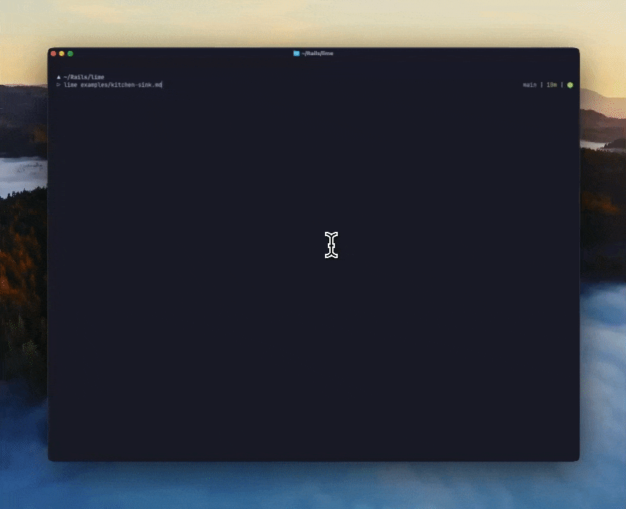

# 🍋‍🟩 lime

### Beautiful markdown rendering in your terminal
Built for Ghostty and macOS, might work with other things, idk, I haven't tested it.



## Features

- Large headings
- Formatted tables
- Highlighted code
- Images
- Mermaid diagrams
- Your terminals native theme
- Jump between headings with keyboard shortcuts
- Table of contents navigation
- Keyboard shortcuts help
- Native scrollback
- Native search

## Installation

Requires macOS and [Ghostty](https://ghostty.org) 1.3 or newer. Install with
[uv](https://docs.astral.sh/uv/getting-started/installation/):

```sh
uv tool install git+https://github.com/spencerldixon/lime
```

If you don't have uv:

```sh
curl -LsSf https://astral.sh/uv/install.sh | sh
```

This puts a `lime` command on your PATH. uv fetches its own Python and keeps
the dependencies in an isolated environment, so it will not disturb any Python
you already have.

### Allow it to control Ghostty

The first time you press a navigation key, macOS asks whether to allow
controlling Ghostty. **Say yes.** Moving between headings works by asking
Ghostty to scroll its own viewport, which goes through macOS automation using osascript.

If you dismiss that prompt, the document still renders and scrolls by hand, but
`t`, `n`, `p`, `g` and `G` will silently do nothing, which looks like the keys
are broken. 

Grant it later under `System Settings → Privacy & Security → Automation`, then restart lime.

Mermaid diagrams require installing the npm package; see [Mermaid and local images](#mermaid-and-local-images).

### Usage

```sh
lime README.md                                                     # read something
```

### Updating and Removing

```sh
uv tool install --force git+https://github.com/spencerldixon/lime  # update
uv tool uninstall lime-markdown                                    # remove
```

Note: The command is `lime`; the package is `lime-markdown`, which is the name to use
when updating or removing it.


## Usage

Give lime a file to read:

```sh
lime README.md
```

| Key | Action |
| --- | --- |
| `t` | Table of contents |
| `n` / `p` | Next / Previous heading |
| `g` / `G` | Go to beginning / end of document |
| `?` | Keyboard shortcuts |
| `q`, Ctrl-C, Ctrl-D | Quit |

## How lime works

### Big headings are pictures

A terminal draws one size of text, so a large heading is not something you can
just ask for. 

Ghostty supports the [Kitty graphics
protocol](https://sw.kovidgoyal.net/kitty/graphics-protocol/), which lets a
program hand the terminal a PNG inside an escape sequence and have it drawn
inline. 

For `#`, `##` and `###`, lime renders the heading text into a
transparent image with Pillow and sends it (`src/lime/graphics.py`). The colours
come from asking the terminal what its own palette is, so headings match
whatever theme you use.

The catch is that an image is not text: you cannot search it, select it or copy
it. So underneath each one lime also prints a small dim `## Heading` line. That
line is what ⌘F finds and what you copy. Anything deeper than `###`, and any
heading nested inside a list or quote, stays ordinary text.

### The document lives in scrollback only once

Most terminal readers take over the screen using the *alternate screen*, a
second blank buffer the terminal keeps for full-screen programs. It is why
quitting `less` makes everything vanish, and why your terminal's own search
never really applied to what you were reading.

Lime does the opposite. It prints straight into your normal terminal, the same
way `cat` does. The document simply becomes scrollback: your trackpad scrolls
it, `⌘F` searches it, selection copies it, and it is all still there after lime
exits. Lime prints the document exactly once and never reprints part of it, so
scrollback holds one copy and search results are never duplicated.

The one exception is the table of contents panel, which does use the alternate screen so
it can fill the window without shoving your document upwards. Closing it puts
the screen back untouched and returns you to the heading you were reading, and
while it is open Ghostty's search applies to the panel rather than the document.
Resizing redraws an open panel; the document itself only reflows if you rerun
lime.

### Jumping between heading sections

Ghostty owns the scrollback, so lime asks Ghostty to move rather than moving any
text itself.

Printing ends at the foot of the document, so the first thing lime does is jump
back to the start bookmark, including any introduction above the first heading.

While printing, lime drops an invisible bookmark on its own row just before
every top-level heading, plus one at the very start and one at the very end.
Headings nested inside lists or quotes get no bookmark and are left out of the
contents, since there is nowhere sensible to jump to.

These are OSC 133 *prompt marks*: the signal a shell emits to say "a prompt
starts here", which is how ⌘↑ and ⌘↓ jump between commands. Ghostty does not
mind that lime is not a shell, so the same jumping works on headings, even after
lime exits.

To actually move, lime asks Ghostty over macOS automation to run its own
`jump_to_prompt` action. Every jump is absolute: scroll to the bottom, then
count back N bookmarks. Counting from a known place each time means scrolling
by hand between keypresses cannot leave lime pointing at the wrong heading. An
earlier version stepped one mark at a time relative to wherever the viewport
happened to be, and drifted as soon as anything else moved it.

A heading can only sit at the top of the window when there is a screenful of
content below it, so lime prints one blank screen after the last bookmark to
make room. That is also what `G` targets. Working out *which* Ghostty window
lime is running in turns out to be its own small problem, covered below.

The window title shows `lime · DOC.md · Configure 2/3` so you can see where you
are even when scrolled deep into history, where a status line printed under the
document would be off screen. It only tracks jumps lime made: it cannot see your
trackpad.

### Keys

Lime reads keys from `/dev/tty`, the controlling terminal, rather than from
stdin. That matters because `cat DOC.md | lime -` already uses stdin for the
document, so keystrokes have to come from somewhere else.

That terminal is put in raw mode, which means keys arrive the instant they are
pressed instead of a line at a time, and Ctrl-C arrives as a plain byte for lime
to handle. `src/lime/keys.py` turns those bytes into events, which is less
trivial than it sounds: an arrow key is a multi-byte escape sequence, and a bare
Escape looks exactly like the start of one until enough time passes.

Deciding what a key means is a pure function. `step(state, key, sections)` in
`src/lime/reader.py` takes the current state and returns the next state plus an
action to perform, like `JUMP` or `OPEN`. The loop around it does the actual
work of talking to the terminal. Keeping the decision separate from the effect
is why most of the behaviour can be tested without a real terminal at all.

### When scrolling is unavailable

Moving Ghostty's viewport uses its macOS automation support. To find itself among
Ghostty's terminals, lime briefly renames its window to a random value and asks
which terminal carries that name, then restores the title. Anything else that
owns the title, such as a shell hook or another full-screen program, can overwrite
that name first; lime then falls back to whichever terminal is focused, which is
the one it was just launched in. If automation is unavailable or neither approach
identifies a terminal, the navigation keys do nothing. Lime never reprints a
section to fake a jump: the document is printed once, and scrollback holds
exactly one copy of it. The contents panel and search keep working.

Automatic interactive mode requires Ghostty without tmux, screen, or Zellij,
terminal output, and a controlling terminal for keys. `interactive: on` in the
configuration forces it in other terminals; `interactive: off` prints and exits.
Redirected output and `NO_COLOR` always print and exit. Markdown piped **into** lime,
such as `cat DOC.md | lime -`, can still use the reader when output is a terminal;
keyboard input comes from the controlling terminal separately.

## Contributing

```sh
git clone https://github.com/spencerldixon/lime && cd lime
uv sync
uv run pytest
uv run ruff check src tests scripts
uv run lime examples/kitchen-sink.md
```

`uv run lime` runs the checkout without installing it, so it will not clash with
an installed copy. 

We ship a test document at `examples/kitchen-sink.md` that includes
headings, tables, code, local and remote image cases, Mermaid, and clearly
labelled fallbacks for unsupported extensions. 

Most behaviour is covered by `uv run pytest` without needing a real terminal, 
but anything touching Ghostty's viewport should be checked by eye in Ghostty.

## Configuration and spacing

Lime reads `$XDG_CONFIG_HOME/lime/config.yaml`, or `~/.config/lime/config.yaml`.
It uses the built-in defaults if that file is absent. That file is the only way
to configure lime: the command takes a document and nothing else. Invalid
keys/types produce an error. It never reads configuration from a document's
directory automatically.

```yaml
width: 88
padding: 12
vertical_padding: 6
line_numbers: true
headings: auto
heading_labels: true
images: true
mermaid: auto
font: null
interactive: auto
```

Padding is on **all four sides**: 12 columns left/right and 6 rows top/bottom,
roughly an inch at typical font sizes. Terminals do not report reliable physical
inches. Horizontal padding shrinks in narrow splits; vertical padding is capped
in very short windows. `width` caps content width, with horizontal padding added
when room permits. Redirected output omits the outer padding.

The [example configuration](config.example.yaml) documents every setting. Code
line numbers are on by default; `line_numbers: false` disables them. Very narrow
code blocks omit numbers to preserve room for the source.

## Rendering Mermaid diagrams and local images

Install the optional official renderer with `npm install -g @mermaid-js/mermaid-cli`.

This adds Node/Chromium dependencies, so it is deliberately separate from the
small core package. Once `mmdc` is on PATH, top-level fenced `mermaid` blocks render
automatically in Ghostty. Colours are derived from the terminal's foreground,
background, and accent palette. Explicit styling inside a diagram may override
those colours. Rendering has a 30-second timeout; missing dependencies, invalid
syntax, and renderer failures leave the readable source in place. Disable it with
`mermaid: off` in YAML.

For images, write `` on its own paragraph. Paths are
relative to the document. Remote URLs, unsupported formats, missing images, and
images inside lists/quotes retain their caption/link. PNG/JPEG/WebP files are
limited to 20 MB and 20 megapixels. `images: false` disables inline images.

## Your terminal's theme

Body text and backgrounds inherit Ghostty's defaults. Syntax highlighting and
other accents use its ANSI palette. Image headings query that same palette with
OSC 4: green for H1, cyan for H2, and blue for H3. OSC 10/11 provide the foreground
and background for Mermaid. Lime never sets terminal colours
and has no separate theme to configure.

The query briefly reads the controlling terminal, so piping Markdown on stdin
still works. It has a timeout and restores terminal input settings. If the
palette cannot be read, headings fall back to normal themed text. Image colours
are captured at render time: rerun lime after changing Ghostty's theme or font
size. Existing raster images do not recolour themselves.

## Reading from a pipe or into a file

```sh
cat DOC.md | lime -
lime DOC.md > rendered.txt
```

Lime takes one argument: a document, or `-` for stdin. Everything else lives in
the [configuration file](config.example.yaml). `headings: image` enables graphics
attempts in a TTY when automatic Ghostty detection is unavailable, such as some
SSH sessions. It still requires a successful palette query. Redirected output and
`NO_COLOR` always disable images and styling. Automatic graphics are disabled
inside tmux, screen, and Zellij; use lime directly in Ghostty for image headings.

## Limits and design choices

Ghostty 1.3+ is required for its built-in search UI. The large headings use the
[Kitty graphics protocol](https://sw.kovidgoyal.net/kitty/graphics-protocol/), like
the original proof of concept. They are images, not differently sized terminal
characters. Ghostty's [OSC 66 text-sizing issue](https://github.com/ghostty-org/ghostty/issues/10333)
is still open as checked on 9 September 2026. The small heading labels are what
make those titles searchable and copyable today.

Layout is calculated when the command runs. Resize a split and rerun the command
to reflow tables and image headings. Ghostty's configured scrollback and image
storage limits apply, so exceptionally long documents can lose older content.
The heading font uses Helvetica Neue on macOS, common system fonts on Linux, or
Pillow's fallback. Set `font:` for documents that need additional glyph coverage.
This release does not automatically discover Ghostty's configured font.

HTML layout, LaTeX, remote image downloads, live refresh, and section paging are
outside v0.1. Raw HTML is displayed literally. Terminal control characters in
document text are removed. Code is only displayed; Mermaid source is passed to
the optional local renderer. Lime itself does not fetch remote document content.
