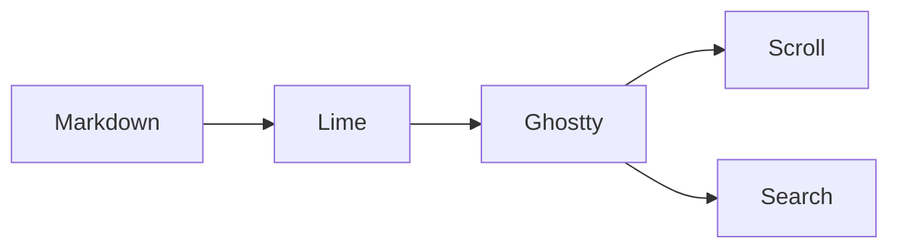

# A little more lime

A Markdown reader that feels at home in **Ghostty**. Big headings, quiet colours,
and real terminal text. Scroll with your trackpad. Find a word with **⌘F**.

## Everything in its place

| Feature | What you get | Text you can select |
| :--- | :--- | :---: |
| Headings | Crisp, enlarged H1–H3 with a searchable label | Yes, the label |
| Tables | Aligned columns; labelled records in narrow splits | Yes |
| Code | Syntax highlighting and wrapping | Yes |
| Links | Clickable destinations | Yes |

## A small, useful command

```sh
lime DOC.md
lime --headings text README.md
cat NOTES.md | lime -
```

### Code should look like code

```python
from pathlib import Path

def greet(name: str) -> str:
    return f"Hello, {name}. Welcome to lime."

print(greet("Ghostty"))
```

The source stays selectable. `inline_code` belongs inside a sentence, and
**bold**, *italic*, and ~~strikethrough~~ keep their meaning.

### Lists, quotes, and a little breathing room

- Read a document in the terminal.
- Keep the things the terminal already does well:
  - Native scrolling and search.
  - Normal text selection and copying.
- [x] Make a small first version.
- [ ] Discuss a future section-paging mode.

> Good tools do a small job well.
>
> They also know when to get out of the way.

1. Open a file.
2. Find what you need.
3. Get back to work.

#### Smaller headings remain text

Read about [Ghostty](https://ghostty.org), or open the [project README](../README.md).

---

## Room for a longer heading that wraps comfortably inside a narrow terminal split

Try this document at 40 columns with `lime --width 40 examples/demo.md`.
Every table value should still be visible.

### That's all for now




Lime prints into your existing terminal and returns to the shell. The document
stays in scrollback, ready to search.
