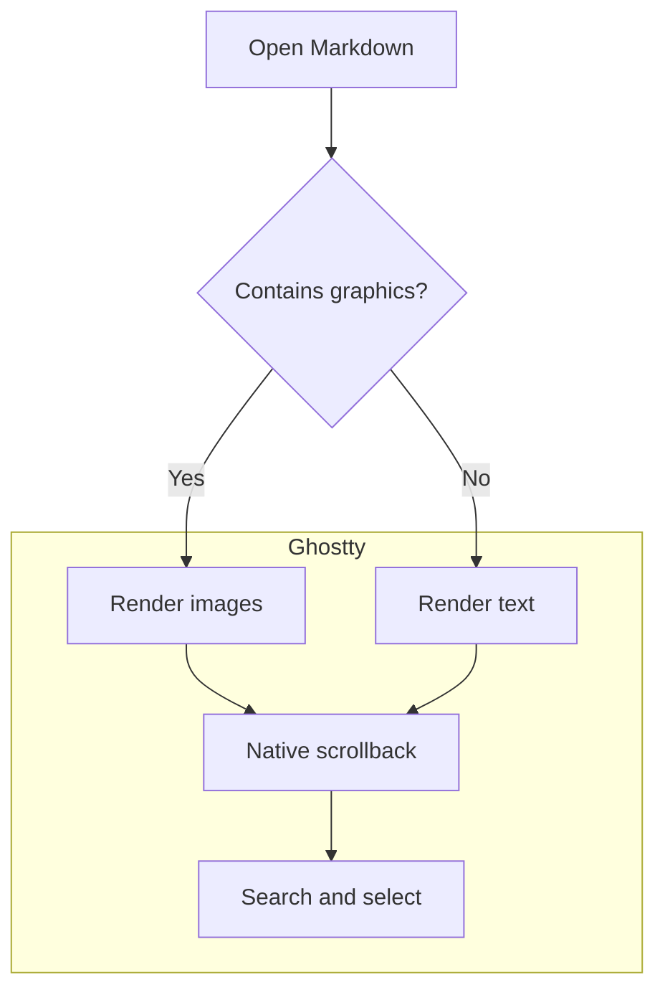
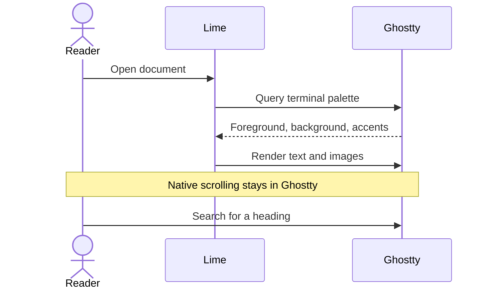
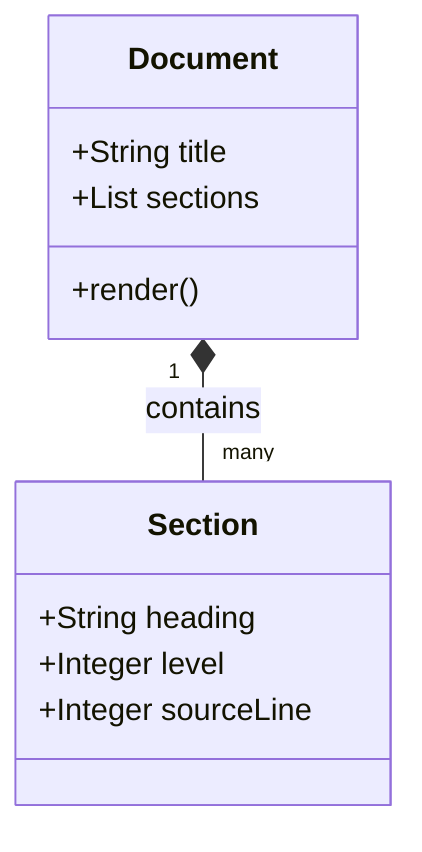
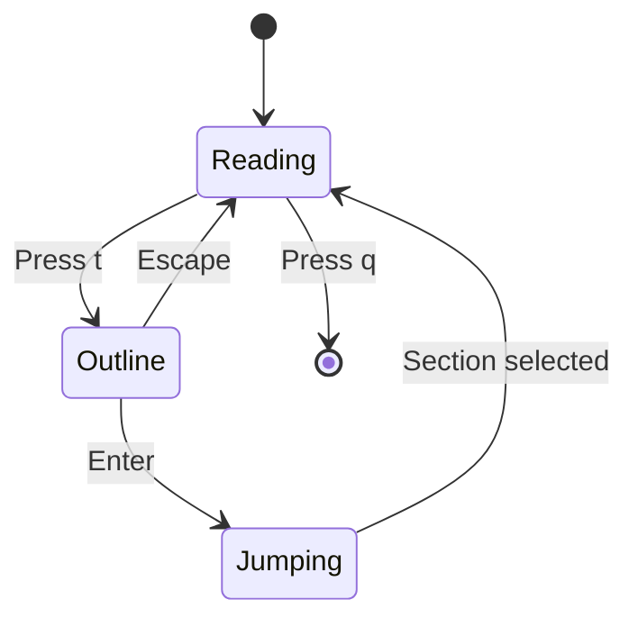

# Lime Markdown kitchen sink

Use this document to check layout, colours, image placement, selection, and
Ghostty's native search. It covers CommonMark, common GitHub-flavoured Markdown,
Mermaid, and a selection of extensions. Markdown dialects differ: the sections
marked **fallback** deliberately exercise features lime does not interpret yet.

```sh
lime examples/kitchen-sink.md
lime --width 40 examples/kitchen-sink.md
lime --headings text examples/kitchen-sink.md
lime --no-line-numbers examples/kitchen-sink.md
lime --plain examples/kitchen-sink.md
```

Expected defaults: padding on all four sides, code line numbers, terminal theme
colours, enlarged H1–H3, and searchable text captions below enlarged headings.
Rerun after resizing the window to recalculate the layout.

Mermaid images require `mmdc` on PATH. Without it, the source should remain
readable. This checkout has a development copy of the renderer; to use it with
the installed Chrome without changing your shell configuration:

```sh
PATH="$PWD/.build/mermaid/node_modules/.bin:$PATH" \
PUPPETEER_EXECUTABLE_PATH="/Applications/Google Chrome.app/Contents/MacOS/Google Chrome" \
lime examples/kitchen-sink.md
```

## Quick visual checklist

- [ ] Horizontal and vertical padding surround the document.
- [ ] Heading sizes decrease consistently and never overlap body text.
- [ ] Search finds the unique heading title further down this document.
- [ ] Emphasis, inline code, and links remain readable in the terminal theme.
- [ ] Every table column and value remains visible in a narrow split.
- [ ] Code indentation, blank lines, and line numbers survive wrapping.
- [ ] The local image renders with a searchable caption.
- [ ] Remote images retain their captions and links; they are not downloaded.
- [ ] Mermaid diagrams render when the optional renderer is available.
- [ ] The deliberately invalid Mermaid block leaves its source readable.
- [ ] The end-of-document marker is present: END-OF-LIME-KITCHEN-SINK.

## Headings

# Level one heading

Body text after H1. This should begin below the enlarged heading and its caption.

## Level two heading

Body text after H2.

### Level three heading

Body text after H3.

#### Level four heading

H4 is ordinary styled terminal text.

##### Level five heading

H5 is ordinary styled terminal text.

###### Level six heading

H6 is ordinary styled terminal text.

Setext level one
================

An underlined heading should behave like an ATX H1.

Setext level two
----------------

An underlined heading should behave like an ATX H2.

### A heading with **bold**, *emphasis*, `inline code`, and a [link](https://ghostty.org)

Formatting markers should not leak into the image title. The searchable caption
should contain the words of the heading.

### This deliberately long heading should wrap over several lines in a narrow terminal while retaining every word and leaving enough room for the paragraph below it

This paragraph should never overlap the heading image, even near the bottom of
the terminal window.

### HeadingNeedleKestrel742

Search for the title directly above this paragraph. Its unique word appears only
in that heading, so a match cannot come from a repeated body-text instruction.

### Repeated title

First occurrence: a future heading picker should be able to distinguish this
section from the next one by its source position.

### Repeated title

Second occurrence: native search should offer a separate match.

## Paragraphs and line breaks

This sentence is on one source line.
This sentence is on the next source line, with no blank line between them.
Together they form a single paragraph with soft line breaks.

This is a separate paragraph. It contains enough text to cross the usual reading
width and demonstrate wrapping while preserving a comfortable margin on both
sides. Narrowing the reading width should move whole words where possible.

This line ends with a Markdown backslash hard break.\
This must begin on the next rendered line.\
This must begin on another rendered line in the same paragraph.

## Inline formatting

Plain text, **strong text**, __alternative strong__, *emphasis*, _alternative
emphasis_, ***strong emphasis***, and **strong text containing *emphasis***.

~~Struck-out text~~ followed by text that is still current.

Inline code: `lime DOC.md`, `snake_case`, `a | b`, and `**literal asterisks**`.

Double-backtick delimiters can include a backtick: ``printf `example` ``.

Escaped punctuation: \*literal asterisks\*, \_literal underscores\_,
\[literal brackets\], \# not a heading, and a literal backslash: \\.

HTML entities: &amp; &lt; &gt; &quot; &copy; &#169; &#x2192;.

## Lists

### Unordered and nested

- First item using a hyphen.
- Second item with **bold**, *emphasis*, and `code`.
  - Nested item.
    - Third-level item.
  - Another nested item with a longer sentence that should wrap underneath its
    own text rather than underneath the outer bullet.
- Back at the outer level.

* Asterisk bullet.
* Another asterisk bullet.

+ Plus-sign bullet.
+ Another plus-sign bullet.

### Ordered and nested

1. First step.
2. Second step.
   1. First substep.
   2. Second substep.
3. Third step.

An independently started ordered list:

7. This ordered list deliberately begins at seven.
8. This should follow at eight.

### Loose list with multiple blocks

- This item contains more than one paragraph.

  This second paragraph still belongs to the first item.

- This item contains a code block:

  ```python
  for number in range(3):
      print(number)
  ```

- This item contains a quote:

  > A quote nested inside a list.

### Task lists

Checkbox markers currently remain readable text rather than interactive widgets.

- [x] Completed task.
- [X] Completed task using an uppercase X.
- [ ] Incomplete task.
  - [x] Completed nested task.
  - [ ] Incomplete nested task.

## Blockquotes

> A simple quote with **strong text**, *emphasis*, and `inline code`.
>
> A second paragraph in the same quote.

> An outer quote.
>
> > A nested quote.
> >
> > Another nested paragraph.
>
> Back to the outer quote.

> ### A heading inside a quote
>
> This heading should remain terminal text inside the quote.
>
> - A quoted list item.
> - Another quoted list item.
>
> ```sh
> printf 'A quoted code block\n'
> ```

## Thematic breaks

Hyphens:

---

Asterisks:

***

Underscores:

___

## Links

An [inline web link](https://ghostty.org), a
[link with a title](https://www.python.org "Python home page"), and an
[email link](mailto:hello@example.com).

A [full reference link][ghostty-home], a [collapsed reference][], and a
[shortcut-reference]. The definitions live at the end of this document to check
that references survive heading boundaries.

An explicit URL autolink: <https://ghostty.org>.

An explicit email autolink: <hello@example.com>.

A bare URL: https://ghostty.org — Ghostty may recognise this independently of
Markdown parsing.

A [relative document link](../README.md), a [local image link](diagram.png),
and a [fragment link](#tables). Fragment links are a navigation test; lime does
not currently implement in-document anchor jumps.

An intentionally undefined [reference][missing-reference] should remain readable.

## Tables

### Alignment and inline formatting

| Left aligned | Centred | Right aligned |
| :--- | :---: | ---: |
| **Bold cell** | *Italic cell* | 12 |
| `inline_code` | [Link](https://ghostty.org) | 1,234.50 |
| ~~Removed~~ | Kept | -7 |
| Empty neighbour | | 0 |

### Escaped pipes and special characters

| Expression | Meaning |
| --- | --- |
| A \| B | An escaped pipe inside a cell |
| `left\|right` | A pipe inside an inline code span |
| &lt;tag&gt; | Decoded entity text |
| **Bold** and *italic* | Several styles in one cell |

### Wide table

At narrow widths this should switch to labelled records. Check that the last
column and every value survive.

| Package | Owner | Status | Version | Platform | Notes |
| --- | --- | --- | ---: | --- | --- |
| lime | Reader team | Ready | 0.1 | macOS | WIDE-TABLE-LAST-COLUMN-ALPHA |
| renderer | Display team | Testing | 2.4 | Linux | WIDE-TABLE-LAST-COLUMN-BETA |

### Long cells and Unicode

| Name | Description |
| --- | --- |
| A long cell | This sentence should wrap over several lines without pushing the table outside the document width. |
| Unbroken | abcdefghijklmnopqrstuvwxyz0123456789ABCDEFGHIJKLMNOPQRSTUVWXYZ |
| 日本語 | 日本語の文章と表示幅の確認 |
| Accents | café, naïve, résumé, São Paulo |
| Emoji | 🍋 🚀 ✅ |

### Header without body rows

| Header one | Header two |
| --- | --- |

## Code blocks

### Python: indentation and blank lines

```python
from pathlib import Path


def read_document(path: Path) -> str:
    """Preserve indentation, quotes, and blank lines."""
    if path.exists():
        return path.read_text(encoding="utf-8")
    return "No document found"


print(read_document(Path("README.md")))
```

### Ruby

```ruby
class Document
  attr_reader :title

  def initialize(title:)
    @title = title
  end

  def heading
    "# #{title}"
  end
end
```

### JavaScript

```javascript
const sections = ["Introduction", "Installation", "Usage"];
const matches = sections.filter((title) => /install/i.test(title));
console.log({ matches, count: matches.length });
```

### Shell

```sh
# These commands are examples; lime must never execute them.
document='a file with spaces.md'
printf '%s\n' "$document"
printf '%s\n' '# A heading inside code is not a document heading'
```

### JSON

```json
{
  "title": "Lime",
  "enabled": true,
  "padding": { "horizontal": 12, "vertical": 6 },
  "features": ["headings", "tables", "code"],
  "optional": null
}
```

### YAML

```yaml
width: 88
padding: 12
vertical_padding: 6
line_numbers: true
headings: auto
images: true
mermaid: auto
```

### SQL

```sql
SELECT title, heading_level
FROM sections
WHERE title LIKE '%installation%'
ORDER BY source_line ASC;
```

### Diff

```diff
--- before.yaml
+++ after.yaml
@@ -1,2 +1,2 @@
-line_numbers: false
-padding: 2
+line_numbers: true
+padding: 12
```

### Long lines

```text
This deliberately long source line should wrap without losing its final marker, even in a narrow split: LONG-CODE-LINE-END.
abcdefghijklmnopqrstuvwxyz0123456789ABCDEFGHIJKLMNOPQRSTUVWXYZabcdefghijklmnopqrstuvwxyz0123456789
```

### Tilde fence

~~~python
print("A tilde-delimited code block")
~~~

### Indented code

    This block is indented by four spaces.
        This line has another indentation level.

    This line follows a blank line inside the block.

### Fence without a language

```
Plain code with no language label.
# This is code, not a heading.
| This | is not | a table |
```

### Unknown language fallback

```not-a-real-language
arbitrary syntax { value: "still readable" }
```

### Markdown inside Markdown

````markdown
# This heading belongs to the example

```python
print("A nested fence")
```

**These stars are literal source text.**
````

## Local images

### Standalone local PNG

The image below should render inline.


### Reference-style local image

![Reference-style local diagram][local-diagram]

### Image inside a sentence: fallback

Before the image  and after the image.
Images embedded in a sentence currently remain a caption/link.

### Linked image: fallback

[](../README.md)

### Image inside a quote: fallback

> 

### Missing local image: fallback


## Remote images: caption and link fallback

Remote images are deliberately not downloaded by lime v0.1. Both captions below
should remain visible and clickable. This section also exercises remote-image
syntax for a future renderer.

### Remote PNG from GitHub


### Remote PNG from Python


### Reference-style remote image

![Reference-style remote Python logo][python-logo]

## Mermaid diagrams

Each valid diagram should become an inline image when `mmdc` is available. The
source remains underneath for copying and search. Without the renderer, or when
output is redirected, expect source text. Diagram colours should fit the terminal
theme; ordinary imported images keep their original colours.

### Flowchart with a decision and subgraph



### Sequence diagram



### Class diagram



### State diagram



This state diagram describes the proposed interactive reader, not current
key bindings.

### Deliberately invalid Mermaid: fallback

The next block is intentionally broken. Rendering should continue after it.

```mermaid
flowchart TD
    A[This label is intentionally unclosed
```

MERMAID-ERROR-RECOVERY: this paragraph must remain visible after the invalid block.

## Unicode and typography

Accented Latin text: café, naïve, résumé, jalapeño, smörgåsbord, Łódź.

Other scripts: Ελληνικά · Кириллица · 日本語 · 中文 · 한국어.

Right-to-left samples: العربية · עברית. Inspect the terminal's ordering and
glyph coverage rather than assuming full bidirectional layout support.

Symbols: ← ↑ → ↓ ↔ ✓ ✗ ± × ÷ ≠ ≤ ≥ ∞ © ® ™.

Emoji: 🍋 🚀 ✅ 👩‍💻 🏳️‍🌈.

Combining characters: café / café. These two forms should look similar but use
different Unicode representations, which can affect search.

### Unicode heading: Café, Ελληνικά, 日本語 🍋

Check both the raster heading's font coverage and its terminal-text caption.

## Common extensions: inspect the fallback

These are included for coverage, not as a claim that every Markdown extension is
supported. Literal syntax is expected where lime has no extension renderer.

### GitHub-style alerts

> [!NOTE]
> Note content should remain readable as a quote.

> [!TIP]
> A tip about checking terminal colours.

> [!IMPORTANT]
> Important information should not disappear.

> [!WARNING]
> Warning content remains ordinary displayed text.

> [!CAUTION]
> Caution content remains ordinary displayed text.

### Footnotes

This sentence has a footnote reference.[^example-note]

[^example-note]: This is the footnote's text. Lime does not currently lay it out as a linked footnote.

### Definition list

Markdown
: A lightweight markup language.

Ghostty
: The terminal displaying this document.

### Math

Inline mathematics: $E = mc^2$.

$$
\int_0^1 x^2\,dx = \frac{1}{3}
$$

Math currently remains source text.

### Highlight, subscript, and superscript

==Highlighted text==, H~2~O, and x^2^ are extension syntax rather than built-in
formatting in the current renderer.

### HTML elements

<details>
<summary>A collapsible section in HTML-capable viewers</summary>

This content must stay readable even though the section does not collapse.

</details>

<kbd>Cmd</kbd> + <kbd>F</kbd>, H<sub>2</sub>O, x<sup>2</sup>, and <mark>marked text</mark>.

An explicit HTML break:<br>Text after the break tag.

<!-- This HTML comment is deliberately visible when HTML is rendered literally. -->

### Metadata syntax

Front matter is not interpreted as metadata. The following fenced sample shows
the syntax without putting metadata in control of this test document:

```yaml
---
title: Markdown rendering test
tags:
  - ghostty
  - markdown
---
```

## Final rendering check

If you can read this paragraph, rendering reached the end after the missing
image, unsupported extensions, and deliberately invalid Mermaid block.

Check that the document's bottom padding follows this final marker:

**END-OF-LIME-KITCHEN-SINK**

[ghostty-home]: https://ghostty.org "Ghostty home page"
[collapsed reference]: https://www.python.org "Python home page"
[shortcut-reference]: https://ghostty.org/docs
[local-diagram]: diagram.png "Existing local PNG fixture"
[python-logo]: https://www.python.org/static/community_logos/python-logo.png "Python logo"
